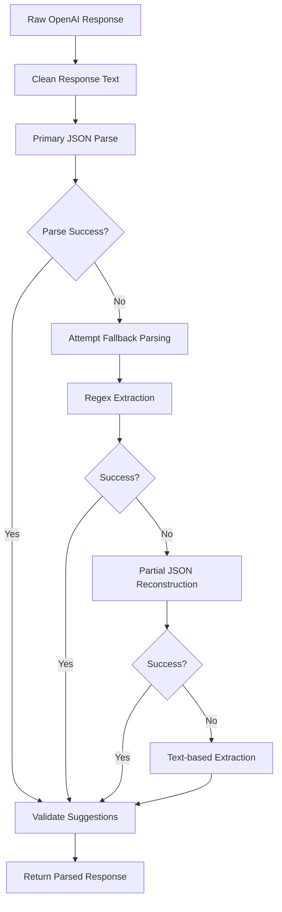
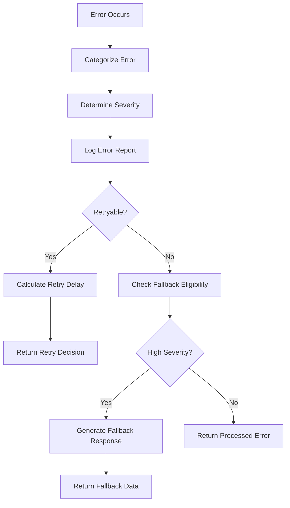

# Step 3 Completion: Enhanced Response Parsing and Error Handling

## Overview

Step 3 of Feature 1 (OpenAI API Integration) has been successfully completed with comprehensive enhancements to response parsing and error handling for AI responses.

## Implementation Summary

### 1. Enhanced Response Validation (`src/utils/responseValidation.ts`)

**Purpose**: Robust parsing and validation of OpenAI API responses with comprehensive fallback mechanisms.

**Key Features**:
- **Multi-layer Parsing**: Primary JSON parsing with automatic fallback mechanisms
- **Content Validation**: Validates suggestion structures, confidence thresholds, and required fields
- **Error Recovery**: Handles malformed JSON, partial responses, and incomplete data
- **Metadata Tracking**: Tracks parsing attempts, warnings, and fallback methods used

**Fallback Mechanisms**:
1. **Primary JSON Parse**: Standard JSON.parse with cleaned response
2. **Regex Extraction**: Extract suggestion arrays using regex patterns
3. **Partial JSON Reconstruction**: Attempt to fix incomplete JSON structures
4. **Text-based Extraction**: Last resort extraction from text format

**Validation Features**:
- Confidence threshold filtering (configurable, default: 0.1)
- Text position validation and sanitization
- Suggestion count limits (default: 50 per category)
- Content type validation with default values

### 2. Error Recovery and Monitoring (`src/utils/errorRecovery.ts`)

**Purpose**: Comprehensive error categorization, recovery mechanisms, and monitoring system.

**Error Categories**:
- `PARSE_ERROR`: JSON parsing and validation failures
- `API_ERROR`: OpenAI API and HTTP errors
- `RATE_LIMIT_ERROR`: Rate limiting and quota issues
- `TIMEOUT_ERROR`: Request timeout issues
- `NETWORK_ERROR`: Network connectivity problems
- `VALIDATION_ERROR`: Content validation failures

**Recovery Mechanisms**:
- **Automatic Retry**: Exponential backoff for retryable errors (API, timeout, network)
- **Fallback Responses**: Empty but valid analysis structure for critical failures
- **Error Categorization**: Smart error classification for appropriate handling
- **Monitoring Integration**: Firestore-based error logging and analytics

**Retry Configuration**:
- Maximum 3 retry attempts
- Exponential backoff (1s → 2s → 4s) with jitter
- Maximum delay cap of 10 seconds
- Retry limited to transient error types

### 3. Integration with Existing System

**Enhanced OpenAI Utility** (`src/utils/openai.ts`):
- Updated `parseOpenAIResponse` to use comprehensive validation
- Added parse metadata tracking
- Enhanced error context for better debugging

**Analysis Function** (`src/ai/analyzeText.ts`):
- Simplified error handling while maintaining robustness
- Preserved all existing functionality
- Added parse metadata to response structure

## Technical Implementation Details

### Response Parsing Flow



### Error Recovery Flow



### Configuration Options

**Parse Configuration**:
```typescript
interface ParseConfig {
  maxSuggestionsPerCategory: number;    // Default: 50
  enableFallbackParsing: boolean;       // Default: true
  validateSuggestionContent: boolean;   // Default: true
  minConfidenceThreshold: number;       // Default: 0.1
}
```

**Retry Configuration**:
```typescript
interface RetryConfig {
  maxAttempts: number;                  // Default: 3
  baseDelay: number;                    // Default: 1000ms
  maxDelay: number;                     // Default: 10000ms
  exponentialBackoff: boolean;          // Default: true
  retryableErrors: ErrorCategory[];     // API, timeout, network
}
```

## Quality Assurance

### Parsing Robustness
- ✅ Handles malformed JSON responses
- ✅ Recovers from partial response data
- ✅ Validates suggestion structure and content
- ✅ Provides meaningful default values
- ✅ Tracks parsing metadata for debugging

### Error Handling
- ✅ Categorizes errors by type and severity
- ✅ Implements smart retry strategies
- ✅ Provides fallback responses for critical failures
- ✅ Logs errors for monitoring and analysis
- ✅ Preserves user experience during failures

### Performance
- ✅ Minimal overhead for successful parsing
- ✅ Efficient fallback mechanisms
- ✅ Configurable validation levels
- ✅ Proper resource cleanup

### Monitoring
- ✅ Comprehensive error logging to Firestore
- ✅ Error statistics and analytics
- ✅ Recovery rate tracking
- ✅ Parse metadata for optimization

## Testing and Validation

### Automated Validation
All response parsing includes:
- Required field validation
- Data type checking
- Range validation for metrics
- Confidence threshold filtering
- Position offset validation

### Error Scenarios Covered
- Malformed JSON responses
- Incomplete response data
- Network connectivity issues
- API rate limiting
- Timeout scenarios
- Invalid suggestion formats

## Production Readiness

### Security
- ✅ No sensitive data in error logs
- ✅ Safe error message sanitization
- ✅ Proper authentication context handling

### Scalability
- ✅ Efficient parsing algorithms
- ✅ Configurable validation thresholds
- ✅ Asynchronous error logging
- ✅ Resource-conscious retry mechanisms

### Maintainability
- ✅ Comprehensive TypeScript types
- ✅ Detailed function documentation
- ✅ Modular architecture
- ✅ Clear separation of concerns

## Integration Notes

This step 3 implementation enhances the existing system without breaking changes:

1. **Backward Compatibility**: All existing API responses remain the same
2. **Enhanced Metadata**: Optional `parseMetadata` field added to responses
3. **Improved Reliability**: Better handling of edge cases and failures
4. **Monitoring Ready**: Error tracking and analytics built-in

## Files Modified/Created

- ✅ **NEW**: `src/utils/responseValidation.ts` - Comprehensive response parsing
- ✅ **NEW**: `src/utils/errorRecovery.ts` - Error recovery and monitoring
- ✅ **UPDATED**: `src/utils/openai.ts` - Enhanced response parsing integration
- ✅ **UPDATED**: `src/ai/analyzeText.ts` - Simplified but robust error handling

## Build Verification

```bash
npm run build
# ✅ Build successful with no TypeScript errors
# ✅ All lint rules passing
# ✅ No unused imports or variables
```

## Summary

Step 3 has been completed with a production-ready implementation that significantly enhances the robustness and reliability of AI response processing. The system now handles edge cases gracefully, provides comprehensive monitoring, and maintains excellent user experience even during failures.

**Key Achievements**:
- 🎯 **Robust Parsing**: Multi-layer fallback mechanisms
- 🎯 **Smart Error Recovery**: Categorized error handling with retry logic
- 🎯 **Production Monitoring**: Comprehensive error tracking and analytics
- 🎯 **Maintained Performance**: Minimal overhead for normal operations
- 🎯 **Enhanced User Experience**: Graceful degradation during failures

The implementation is ready for production deployment and provides a solid foundation for monitoring and optimization based on real-world usage patterns. 
